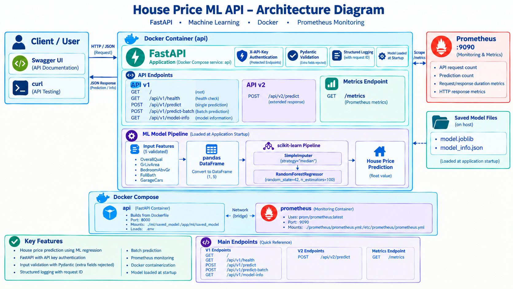

# House Price Prediction ML API

## Project Overview

This project is a machine learning-based **House Price Prediction API**.

A trained regression model predicts the estimated sale price of a house from selected property features. The model is exposed through a FastAPI REST API with input validation, API-key authentication, structured logging, Docker containerization and Prometheus monitoring.

The project also includes API versioning, batch prediction, automated tests and a V2 prediction endpoint with an extended response format.

## Machine Learning Problem

The machine learning problem is **House Price Prediction**.

This is a supervised regression problem because the model learns from existing house data and predicts a continuous numerical value representing the sale price.

The project uses a machine learning pipeline containing preprocessing and a `RandomForestRegressor` model.

The trained model is saved using Joblib and loaded by the FastAPI application when the API starts.

## Dataset

The project uses the **Kaggle House Prices dataset**.

The dataset contains residential property information and corresponding sale prices.

For the API, the model accepts five selected features:

- `OverallQual` — Overall material and finish quality, from 1 to 10
- `GrLivArea` — Above-ground living area in square feet
- `BedroomAbvGr` — Number of bedrooms above ground
- `FullBath` — Number of full bathrooms
- `GarageCars` — Garage capacity in cars

The target variable used during model training is the house sale price.

## Architecture

The application is built using FastAPI and runs inside a Docker container. The API loads the trained machine learning pipeline at startup and uses it to process house price prediction requests.

Prometheus runs as a separate Docker Compose service and collects monitoring metrics from the API through the `/metrics` endpoint.



## Request Flow

The application follows this general request flow:

```text
Client
  |
  | HTTP Request
  v
FastAPI Application
  |
  +--> Request ID Middleware
  |
  +--> API-Key Authentication
  |
  +--> Pydantic Input Validation
  |
  +--> Convert Request Data to DataFrame
  |
  +--> Loaded ML Model
  |        |
  |        +--> Prediction
  |
  +--> Logging and Metrics
  |
  v
JSON Response
```

## API Contract

The API provides versioned prediction endpoints along with health, model information and monitoring endpoints.

### API Endpoints

| Method | Endpoint | Description | Authentication |
|--------|----------|-------------|----------------|
| GET | `/` | Returns a basic API status message | Not required |
| GET | `/api/v1/health` | Checks API health and whether the ML model is loaded | Not required |
| POST | `/api/v1/predict` | Predicts the price of one house | `X-API-Key` |
| POST | `/api/v1/predict-batch` | Predicts prices for multiple houses | `X-API-Key` |
| GET | `/api/v1/model-info` | Returns information about the trained model | `X-API-Key` |
| POST | `/api/v2/predict` | Predicts the price of one house using the V2 response format | `X-API-Key` |
| GET | `/metrics` | Exposes Prometheus monitoring metrics | Not required |

### Prediction Input

The prediction endpoints accept the following house features:

- `OverallQual` — Overall material and finish quality, from 1 to 10
- `GrLivArea` — Above-ground living area in square feet
- `BedroomAbvGr` — Number of bedrooms above ground
- `FullBath` — Number of full bathrooms
- `GarageCars` — Garage capacity in cars

Pydantic validates the request before the data is passed to the machine learning model. Unexpected fields are rejected.

### Authentication

Prediction and model-information endpoints require an API key in the request header:

```text
X-API-Key: your-api-key
```

The client sends house features to the `/predict` endpoint. The API first validates the received data. If the data is valid, it is passed to the trained machine learning regression model. The model generates an estimated house price, which is returned to the client as a JSON response.

## Machine Learning Model

The project uses a supervised machine learning regression model to predict house sale prices.

### Model Pipeline

The trained pipeline consists of:

- `SimpleImputer(strategy="median")` for handling missing values.
- `RandomForestRegressor` for predicting house prices.
- `n_estimators=100` — the model uses 100 decision trees.
- `random_state=42` — keeps the training results reproducible.

The trained model is saved using Joblib and loaded once when the FastAPI application starts.

### Model Performance

The training dataset contains 1460 rows and 81 columns.

The recorded model performance is:

| Metric | Value |
|---|---:|
| MAE | 21,923.00 |
| R² Score | 0.8694 |

An example prediction from the trained model was approximately **$197,241.37**.

## Project Structure

```text
house-price-ml-api/
│
├── app/
│   ├── models/
│   │   └── schemas.py
│   ├── routers/
│   │   ├── v1.py
│   │   └── v2.py
│   ├── config.py
│   ├── dependencies.py
│   ├── exceptions.py
│   ├── logging_config.py
│   ├── main.py
│   └── metrics.py
│
├── data/
│   └── train.csv
│
├── docs/
│   └── architecture.png
│
├── ml/
│   ├── saved_model/
│   │   ├── model.joblib
│   │   └── model_info.json
│   ├── predict.py
│   └── train.py
│
├── prometheus/
│   └── prometheus.yml
│
├── tests/
│   ├── conftest.py
│   ├── test_health.py
│   ├── test_integration.py
│   ├── test_metrics.py
│   ├── test_model_info.py
│   ├── test_predict.py
│   └── test_v2_predict.py
│
├── .dockerignore
├── .env.example
├── .gitignore
├── Dockerfile
├── docker-compose.yml
├── load_test.py
├── requirements.txt
├── TESTING.md
└── README.md
```

## Project Goal

The goal of this project is to understand how a machine learning regression model can be developed, exposed through a REST API, containerized using Docker and monitored in a practical software engineering workflow.

## How to Run This Project

### Prerequisites

Before running the project, make sure you have:

- Git installed
- Docker Desktop installed and running
- Python installation is not required because the application runs inside a Docker container.
- Python installation is required if you want to run the test suite locally.

### 1. Clone the Repository

Clone the project from GitHub:

```cmd
git clone https://github.com/sourav-srv916/house-price-ml-api
```

Move into the project directory:

```cmd
cd house-price-ml-api
```

### 2. Create the `.env` File

Create your local `.env` file from `.env.example`:

```cmd
copy .env.example .env
```

### 3. Start the Application

Build the Docker image and start the API using Docker Compose:

```cmd
docker compose up --build
```

### 4. Access the API

Open Swagger UI in your browser:

```text
http://localhost:8000/docs
```

Use Swagger UI to test the **Health** and **Prediction** endpoints.

### 5. Run the Project Again

If no project changes were made and the image is already built:

```cmd
docker compose up
```

No rebuild is required.

### 6. Stop the Application

Press `Ctrl+C` or run:

```cmd
docker compose down
```

### 7. Rebuild After Project Changes

If project files, dependencies, the Dockerfile, or model configuration changes:

```cmd
docker compose up --build
```
## Deployment

The API is deployed as a Docker Web Service using Render.

The deployment uses the Dockerfile included in this repository.

### Deployment Configuration

- Service type: Web Service
- Runtime: Docker
- Region: Singapore
- Branch: main
- Plan: Free

### Environment Variables

The following environment variables are configured in Render:

- `MODEL_PATH`
- `MODEL_INFO_PATH`
- `API_KEY`

The API key is stored as a secret environment variable and is not committed to the repository.

### Public API

The deployed API can be accessed using the public Render URL.

Swagger documentation is available at:

```text
https://house-price-ml-api-lcp2.onrender.com/docs
```

## API Examples

The API can be tested using `curl` in Windows `cmd`.

Replace `YOUR_API_KEY` with the API key configured in the `.env` file.

### 1. API Status
```cmd
curl "http://localhost:8000/"
```
### 2. Health Check
```cmd
curl "http://localhost:8000/api/v1/health"
```

### 3. V1 Prediction
```cmd
curl -X POST "http://localhost:8000/api/v1/predict" -H "Content-Type: application/json" -H "X-API-Key: YOUR_API_KEY" -d "{\"OverallQual\":7,\"GrLivArea\":2000,\"BedroomAbvGr\":3,\"FullBath\":2,\"GarageCars\":2}"
```

### 4. V1 Batch Prediction
```cmd
curl -X POST "http://localhost:8000/api/v1/predict-batch" -H "Content-Type: application/json" -H "X-API-Key: YOUR_API_KEY" -d "{\"houses\":[{\"OverallQual\":7,\"GrLivArea\":2000,\"BedroomAbvGr\":3,\"FullBath\":2,\"GarageCars\":2},{\"OverallQual\":8,\"GrLivArea\":2500,\"BedroomAbvGr\":4,\"FullBath\":3,\"GarageCars\":2}]}"
```

### 5. Model Information
```cmd
curl -H "X-API-Key: YOUR_API_KEY" "http://localhost:8000/api/v1/model-info"
```

### 6. V2 Prediction
```cmd
curl -X POST "http://localhost:8000/api/v2/predict" -H "Content-Type: application/json" -H "X-API-Key: YOUR_API_KEY" -d "{\"OverallQual\":7,\"GrLivArea\":2000,\"BedroomAbvGr\":3,\"FullBath\":2,\"GarageCars\":2}"
```

### 7. Prometheus Metrics
```cmd
curl "http://localhost:8000/metrics"
```

## Monitoring & Testing

### Monitoring

Prometheus is used to monitor the API.

The `/metrics` endpoint exposes API metrics that can be collected by Prometheus.

Prometheus runs as a separate service using Docker Compose.

### Testing

The project includes automated unit, integration and API tests using `pytest`.

Run the complete test suite with:

```cmd
pytest -q
```

## What I Learned

- By doing this project, I learned how a machine learning model can be used in a real API application.

- I learned how to train a model using Python and scikit-learn, save the trained model and load it in FastAPI for prediction.

- I also learned how to create API endpoints, validate input using Pydantic, add API-key authentication, handle errors and use request IDs for logging.

- During this project, I learned how to use Docker to run the API and Prometheus to monitor the application.

- I also learned how to write tests using pytest, test multiple API requests, perform load testing and organize the project into separate modules.

- Overall, this project helped me understand the complete flow from **machine learning model training to API development, testing, Docker, and monitoring**.

## Independent Extension

As an independent extension, I added a GitHub Actions workflow that automatically runs the pytest test suite whenever code is pushed to the `main` branch.

This helps verify that the existing tests still pass after new changes are pushed to GitHub.

## Final Verification

The project was verified locally using a fresh Docker Compose rebuild.

- Full pytest suite: 20 tests passed
- Docker Compose: API and Prometheus started successfully
- API root: working
- Swagger documentation (`/docs`): working
- V1 prediction endpoint: working
- V1 batch prediction endpoint: working
- V1 model information endpoint: working
- V2 prediction endpoint: working
- Health endpoint: working
- Prometheus metrics: working
- Prometheus scraping: verified
- GitHub Actions workflow: added to run pytest on pushes to `main`
- Render deployment: succeeded
- Public Render API: working
- Deployed API endpoints: tested successfully